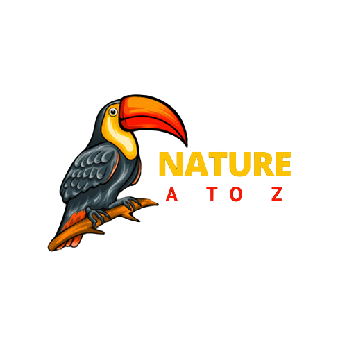

<a name="readme-top"></a>

<!-- PROJECT LOGO -->
<br />
<div align="center">
  <a href="https://github.com/gusperandio/natureatoz">
    
  </a>

  <h3 align="center">Nature A to Z</h3>

  <p align="center">
    An awesome README template to jumpstart your projects!
    <br />
    <a href="https://natureatoz.com.br/docs"><strong>Explore the docs »</strong></a>
    <br />
    <br />
    <a href="https://github.com/gusperandio/natureatoz/issues">Report Bug</a>
    ·
    <a href="https://github.com/gusperandio/natureatoz/issues">Request Feature</a>
  </p>
</div>

<!-- ABOUT THE PROJECT -->

# About the Project

Welcome to the Nature and Environment API, your comprehensive dictionary-like resource providing information on all aspects of nature and the environment from A to Z.

## overview:

The Nature and Environment API is designed to serve as a versatile tool for accessing a wealth of information about various elements of the natural world. Whether you're a researcher, educator, or simply curious about the environment around you, this API offers a vast repository of data conveniently organized from A to Z.

* **Comprehensive Data**: From animals to plants, ecosystems to geological formations, our API covers a wide range of topics related to nature and the environment.
* **Easy Access**: With straightforward endpoints and intuitive queries, accessing detailed information about specific subjects is quick and effortless.
* **Up-to-Date Content**: Our database is regularly updated to ensure that you receive the latest and most accurate information available.
* **Educational Resource**: Ideal for educational purposes, the API provides valuable insights into the intricacies of the natural world, making learning both engaging and accessible.

<p align="right">(<a href="#readme-top">back to top</a>)</p>

### Built With

- [![Next][Next.js]][Next-url]
- [![React][React.js]][React-url]

<p align="right">(<a href="#readme-top">back to top</a>)</p>

## Getting Started

This is an example of how you may give instructions on setting up your project locally.
To get a local copy up and running follow these simple example steps.

<p align="right">(<a href="#readme-top">back to top</a>)</p>

## Usage

#### Return the status of API 

```http
  /api/v1 ⚡
```

| Method| Parameter   | Type       | Description                    |Code|
| :--- | :---------- | :--------- | :--------------------------- |:---|
| **OPTIONS** | `NULL` | `NULL` |  Just check STATUS API  | 202 ✔️ |

<br />

#### TOKEN Authorization

```http
  /api/v1/auth - /api/v1/auth?days=120 📋
```

| Method | Parameter   | Type       | Descrição                    |Code|
| :-- | :---------- | :--------- | :--------------------------- |:---|
| **GET** | `days` | `string` |  Get the token with limite between 30 and 120 days  | 200 ✔️ |

<br />

#### Search random

```http
   /api/v1/random 📋
```

| Method | Header | Parameter   | Type       | Descrição                    |Code|
| :-- |:-- |:---------- | :--------- | :--------------------------- |:---|
| **GET** | `Bearer token - JWT` | `NULL` | `NULL`| Search a random item  | 200 ✔️ |

<br />

#### Search random with IMG

```http
   /api/v1/random/image 📋
```

| Method | Header | Parameter   | Type       | Descrição                    |Code|
| :-- |:-- |:---------- | :--------- | :--------------------------- |:---|
| **GET** | `Bearer token - JWT` | `NULL` | `NULL`| Search a random item with one image | 200 ✔️ |

<br />

#### Search complete list about specific letter

```http
   /api/v1/dictionary/{x} 📋
```

| Method | Header | Parameter   | Type       | Descrição                    |Code|
| :-- |:-- |:---------- | :--------- | :--------------------------- |:---|
| **GET** | `Bearer token - JWT` | `Letter` | `string`| Retrieve all items based on the letter | 200 ✔️ |

<br />

#### Search specific item with base on title

```http
   /api/v1/search/{title} 📋
```

| Method | Header | Parameter   | Type       | Descrição                    |Code|
| :-- |:-- |:---------- | :--------- | :--------------------------- |:---|
| **GET** | `Bearer token - JWT` | `Title` | `string`| Search the item with the name exactly or most closely similar possible | 200 ✔️ |


_For more examples, please refer to the [Documentation](https://natureatoz.com.br/docs)_

<p align="right">(<a href="#readme-top">back to top</a>)</p>

## Contributing

Contributions are what make the open source community such an amazing place to learn, inspire, and create. Any contributions you make are **greatly appreciated**.

If you have a suggestion that would make this better, please fork the repo and create a pull request. You can also simply open an issue with the tag "enhancement".
Don't forget to give the project a star! Thanks again!

1. Fork the Project
2. Create your Feature Branch (`git checkout -b feature/YourFeature`)
3. Commit your Changes (`git commit -m 'Add some YourFeature'`)
4. Push to the Branch (`git push origin feature/YourFeature`)
5. Open a Pull Request

<p align="right">(<a href="#readme-top">back to top</a>)</p>


## License

Distributed under the Apache License 2.0. See `LICENSE.txt` for more information.
[Apache License 2.0](https://github.com/gusperandio/natureatoz/blob/main/LICENSE)

<p align="right">(<a href="#readme-top">back to top</a>)</p>


## Contact

Gustavo Sperandio - [@your_twitter](https://twitter.com/pumpmalone) - gustavo.sperandio25@gmail.com

<p align="right">(<a href="#readme-top">back to top</a>)</p>

[Next.js]: https://img.shields.io/badge/next.js-000000?style=for-the-badge&logo=nextdotjs&logoColor=white
[Next-url]: https://nextjs.org/
[React.js]: https://img.shields.io/badge/React-20232A?style=for-the-badge&logo=react&logoColor=61DAFB
[React-url]: https://reactjs.org/
